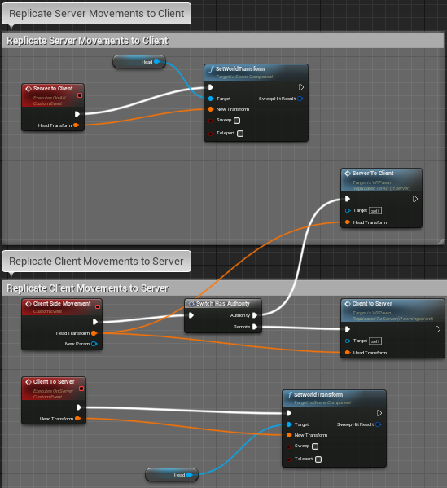
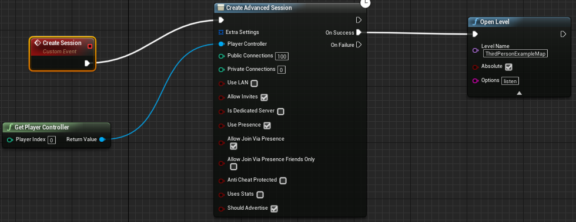
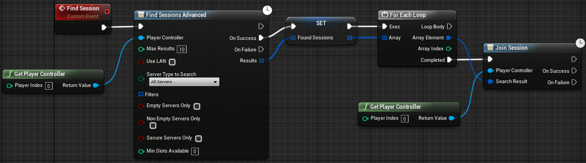

# Analyzing Immersion in a 1v1 VR Game

### University of North Carolina at Chapel Hill

### Alex Proca, Austin Hale, Surya Poddutoori

Here's the link to our demo of the project.

[Demo](https://drive.google.com/file/d/1OnIbGshibSVrg5oBrT1f149j9raDC0T6/view?usp=sharing)

In order to play this game, you need to have Unreal Engine 4.2+ installed. Then clone this repository and start the project. Delete the contents in your plugins folder and replace with the contents found [here](https://forums.unrealengine.com/community/community-content-tools-and-tutorials/41043-advanced-sessions-plugin?69901-Advanced-Sessions-Plugin=), based on the version you have.

## 1 Introduction

### 1.1 Objective

Our objective was to implement a 1v1 multiplayer first-person shooter that accurately analyzes
inputs from two players and generates an acceptable gaming experience. Using Unreal Engine, we
created a multiplayer level environment where two players can fire weapons at each other using
FPS mechanics. The locomotion method used is the steer-to-center redirection algorithm with
translational gain. Users may not leave their bounds when playing the game.

### 1.2 Hypothesis

Our hypothesis is that a 1v1 multiplayer-shooter game that is set in a first-person POV would be
more immersive than the same game played in a 3rd-person POV. Null Hypothesis: First Person
and Third Person POV would have no difference. Alternate Hypothesis: Third Person will be more
immersive. Furthermore, we wanted to survey players on the multiplayer experience.

### 1.3 Similar Studies

- SAP ’16: Proceedings of the ACM Symposium on Applied Perception July 2016 Pages 113–
    https://doi.org/10.1145/2931002.2931018.
- N. C. Nilsson et al., ”15 Years of Research on Redirected Walking in Immersive Virtual Envi-
    ronments,” in IEEE Computer Graphics and Applications, vol. 38, no. 2, pp. 44-56, Mar./Apr.
    2018.
- M. Azmandian, T. Grechkin and E. S. Rosenberg, ”An evaluation of strategies for two-user
    redirected walking in shared physical spaces,” 2017 IEEE Virtual Reality (VR), Los Angeles,
    CA, 2017, pp. 91-98.
- M. Usoh, E. Catena, S. Arman, and M. Slater, ”Using Presence Questionnaires in Reality,”
    PRESENCE: Virtual and Augmented Reality, vol. 9, no. 5, pp. 497-503, Oct. 2000.

## 2 Implementation

### 2.1 Steer-To-Center Algorithm

We first began by constructing a steer to center algorithm. The code for this was done in a previous
class assignment. The same build was then restructured: the camera was oriented to first person,
character model was added, with access to weapons and a clean, minimalistic HUD. Our S2C
algorithm essentially accelerated the rotation of the VR user’s space with respect to the user’s input
rotation.


### 2.2 Remote Procedure Calls

Once we implemented the steer-to-center lo-
comotion algorithm locally, we began using
RPCs for the server and client’s pawn move-
ments. In our approach, we decided to go
against an authoritative server and instead
have the locally controlled pawn implement
its own redirected walking. If the pawn is
not attempting to escape its bounds, we send
its updated transform to both the server and
client. We were able to achieve replicated
movements between the server and client
with no apparent lag.
For the shooting and health mechanics, we
take the user’s left mouse input and notify
the weapon blueprint that the user may start
firing. Once the event reaches the weapon
blueprint, we begin and end the user’s fire
from the server with notify. Any time the
user starts or stops firing locally, this notify
instance alerts both the Network Authority
and Remote Machine of the change in value.

<p align="center">
  
</p>

```
Figure 1: This custom event replicates the client’s pawn movements to the server. When the
event is called with authority, the server pawn’s movements cast to the client.
```
### 2.3 Steam Multiplayer

We used Unreal Engine’s Advanced Session Plugin and Online Subsystem Steam to run multiplayer.
The multiplayer is simply designed for one user to create the session and spawn the first person that
is able to join successfully.

<p align="center">
  
</p>

```
Figure 2:The host creates a public multiplayer Steam session and open the game level.
```

<p align="center">
  
</p>

```
Figure 3:Another Steam player will join the created session.
```

## 3 Analysis

### 3.1 Data Collection and Limitations

Subjects (found through family and roommates) were assigned to either a third-person POV control
group or the first-person POV in our 1v1 shooter game implemented in this study. In both groups,
the players played until they defeated their opponent (reach HP of 0). Both groups then took a
Slater-Usoh-Steed (SUS) Questionnaire to assess their immersion in the game. Due to Coronavirus,
our study’s effectiveness was reduced. In a fully operational environment we would encourage finding
more participants, implementation of actual VR devices and creating a more robust multiplayer
network.

### 3.2 Results

A Univariate ANOVA was run in SPSS using data to analyze whether there was a significant differ-
ence between groups. Our ANOVA resulted in a p-value of 1, indicating that there was no difference
between the groups. We fail to reject our Null Hypothesis. In retrospect this result does make sense
to some extent. We had a limited number of participants who had happened answer identically in
both groups. Furthermore, we realize that our users did not have VR headsets. They were simply
playing the same game, but in different viewpoints. There wasn’t much of a difference they could
particularly feel. Our users also felt that the multiplayer experience did not have much impact. We
believe this was the case because it wasn’t a true VR experience.

## 4 Summary

### 4.1 Conclusion

In conclusion, there was no significant difference between 1st Person and 3rd Person POV in a
multiplayer VR game. Future studies should use VR devices and have more participants. Addi-
tionally, a comparison of games in similar realms and purposes may provide a more stark difference
in results than with two differently styled games. Analysis of other variables, such as enjoyment,
excitement, or physiological response, could be measured in the future. We believe that our analysis
are important in the field of VR development. In an optimal setting our results could further solidify
factors that effect immersion in a virtual world. And analysing these factors in different settings will
help game-makers and creators push their creative limits. Furthermore, multiplayer in VR is fairly
untested, our analysis in these areas could help transform how VR is played.

### 4.2 Challenges

The main challenges we faced were replicating the pawns’ movements to be seen by both the server
and client. By only running the S2C algorithm on the local controller, we were able to successfully
replicate the transforms of both users’ pawns and VR tracking spaces. Another challenge we faced
was implementing the UI and pawn components to successfully register between the server and
client.

### 4.3 Future Work and Limitations

We would love to try our project with two users wearing their own VR headsets. We specifically de-
signed the game to be compatible with virtual reality by using first-person mechanics. Future work
would include the analysis of the user’s multiplayer experience in a virtual world using redirected
walking. Some limitations we endured included Unreal Engine’s PlayerStart spawning implementa-
tion. At times, we had issues with Unreal spawning the actors in the same starting location and
thus allowing for one of the pawns to not spawn at all.


### 4.4 Acknowledgements

Special thanks to Technical Writer Michael Prinke of Unreal Engine for covering the fundamentals
of the server-client model. We would also like to thank our instructor Nick Rewkowski for the
steer-to-center redirection algorithm implementation. Assets from turbosquid.com.

### 4.5 Collaboration

Alex worked on the data collection and analysis. Austin implemented the RPCs and Steam Multi-
player. Surya worked on S2C, game functionality, sound, and scene setup. Surya, Austin and Alex
all worked together on the write-up and analyzing our results.
